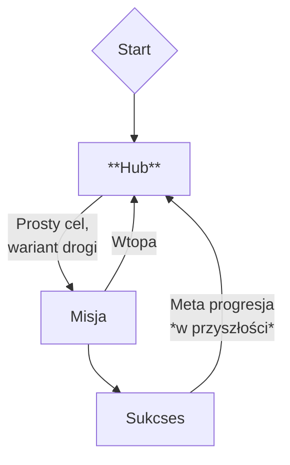

# Projekt Tatar / *Sandomiria Demonicum*

**Ważne:** To nie jest PEŁNY Game Design Document (GDD). To jego skrócona forma, w pigułce, gdzie można na szybko zobaczyć referencje do projektu.

Cały gdd jest dostępny na moim [google docs](https://docs.google.com/document/d/19uCRrQVWnURyPtc2AgovklYakjnQ9GKKkZ5gvh5dAlM/edit?usp=sharing) (*W.I.P*).

## Ogólny zarys

`PvE Dark Fantasy FPS` z `zombie`. Trochę `post-apo`, trochę `survival horroru` (bo atmosfera oraz zarządzanie zasobami).

Ogólnie całość ma dawać *vibe* filmu fantasy/dark fantasy z lat osiemdziesiątych. Nie 1:1, ale ścieżka dźwiękowa oraz wizualia będą czerpać stąd inspiracje. Przykłady: [Clash of the Titans (1981)](https://www.youtube.com/watch?v=ojw1sau98Jg), [Dragonslayer (1981)](https://www.youtube.com/watch?v=vWVJr7JbJZc), [Deathstalker (1983)](https://www.youtube.com/watch?v=P8FTMs4hzZk), [The Green Knight (2021, tak z 2021)](https://www.youtube.com/watch?v=sS6ksY8xWCY).

### Projekt w pigułce

1. **Docelowo (czyli kiedyś) będzie osiem (8) postaci do wyboru**. Wstępnie natomiast, trzeba mierzyć siły na zamiary, zrobimy dwie (**2**)).
   - Nie ma tworzenia postaci, gracze grają gotowymi archetypami ich, z własną historią, wyglądem i osobowością.
2. **Kierunkowe ciosy**:
   - lewo : prawo (→)
   - prawo : lewo (←)
   - góra : dół (↓)
   - pchnięcie / cios specjalny (↑)
3. **Grafika 3D low-poly, postacie w stylu Synty.**
4. **Brak auto-regeneracji HP** = stosunkowo bardziej uważna rozgrywka.
5. **Hub** = klasztor, który odblokowujemy po tutorialu. Odpala się (tutorial) zaraz po rozpoczęciu rozgrywki.

### Inspiracje i/lub podobne tytuły

| Tytuł | Co czerpiemy |
| :--- | :--- |
| *Elden Ring Nightreign* (2025) | Trochę koncept, 10 **Nightfarers** wyrusza na ekspedycje, aby zażegnać kryzys światowy. |
| Inne tytuły **FromSoftware** | Chociażby estetyka, czy archetypy postaci (przykładowo 'level-up lady' to u nas **Natalia**, z *Ojca Mateusza*, chociaż nadal kusi stary chłop, jakiś przeor). |
| *Lunacid* (2022) | Pierwsza osoba, homage do *King's Fielda* (1994), walka może nie aż tak kierunkowa, ale podobnie strategiczna (nie chcesz dostać obrażeń). |
| *Grim Dawn* (2016) | Motyw post-apo. Może nie będziemy mieć broni palnej, ale fakt że jakieś kosmito-duchy przejmą kontrolę nad światem, a ludzkość przegrywa. |
| *Left 4 Dead 2* (2009) | Wzorzec dla systemu postaci/archetypów. Zamiast tworzyć postać, wybierasz jedną postać z gotowych. Oraz dosłownie pionier gier typu `PvE FPS Zombie`. |
| *Vermintide* | Tak jak **L4D2**, jest to wzorzec dla tego typu gierek, tym bardziej, że to gritty fantasy, z nawet barwniejszymi postaciami. |
| *Dark Messiah of Might & Magic* (2006) | Klasyk, jeśli chodzi o game feel walki wręcz w pierwszej osobie oraz low-poly. |
| *Dread Delusion* (2020) | Idealna referencja wizualna (*Styl 3D Low-poly*). Pokazuje, jak budować niesamowity, oniryczny klimat dark fantasy przy użyciu prostej geometrii |

### Tech stack

- **Silnik:** `Godot`.
- Pipeline:
  - **Figma** - prototypowanie makiet (interaktywnych).
  - **VSC** lub **Obsidian** - sporządzanie dokumentacji i notatek (pliki `.md`)
  - **Blender** - tworzenie modeli 3D.
  - **Substance Painter 3D** - teksturowanie modeli postaci.
  - **GitHub** - repozytorium.

## Rozgrywka (*gameplay*)

### Główna pętla rozgrywki (*core gameplay loop*)

### Główne systemy (i mechaniki)

- **Walka:** `real-time`, gracz ma do wyboru kierunek skąd-dokąd zada cios, ma to różne efekty, w zależności od posiadanej broni.
- **Relikwie i zmiana wyposażenia przed misją:** relikwie realnie mogą zmienić czy postać jest bardziej ofensywna, czy defensywna, jakieś takie pasywne dodatki. Wyposażenie natomiast powinno mieć wpływ na rozgrywkę tj. krótszy zasięg, ale szybszy atak, bo mieczyk ma inną długość, albo porzucamy miecz na rzecz włóczni i jest na odwrót + inna zdolność postaci.
- Dekorowanie **HUBu**: możemy odblokować architekta, który będzie nam ulepszać wystrój, niczym w AC2.

## Design i audio-wideo

### UI / UX

- **HUD**: `HP`, `cooldown` zdolności, dostępne bronie.
- **Interfejsy**: mieszanka `diegetycznych` i `niediegetycznych`.
  - Jak dodamy takie in-game wiki to będzie `diegetycznie`.

### Grafika

- **Art style:** `3D Low-poly`, postacie w stylu synty ([przykład](https://syntystore.com/blogs/blog)).
- **Perspektywa:** pierwszoosobowa.

## Narracja i światotwórstwo (*worldbuilding*)

### Świat

W *Sandomirii Demonicum* będziemy wykorzystać prawdziwą historię Sandomierza z okresu **XIII–XIV wieku** jako bazę i przefiltrujemy ją przez własne ujęcie **dark fantasy**[^1]. W zasadzie to artykuł **Cole**'a legitymuje moje wcześniejsze podejście.

## Archiwum

> *Pierwotnie przeciwnicy mieli wyglądać jak w Boomer Shooter'ach, czyli sprite'y 2D, ale to daje game feel grze aż za szybki(!). Stąd przestawiamy się na robienie 3D modeli. Poza tym kto nie lubi low poly blendować.*

## Ostatnia aktualizacja

2026-01-16
~~2025-12-15~~
~~2025-12-07~~

[^1]: Cole, J. R. (2022) - Mashing Up History and Heritage in Assassin's Creed Odyssey* ([[cole-2022-mashing-up-history-and-heritage-in-assassin-s-creed-odyssey.pdf]]).
