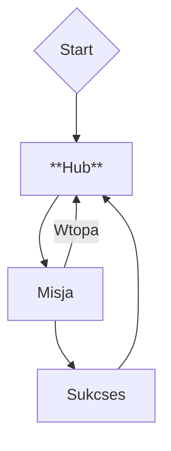

# Projekt Tatar / *Sandomiria Demonicum*

**Ważne:** To nie jest PEŁNY Game Design Document (GDD). To jego skrócona forma, w pigułce, gdzie można na szybko zobaczyć referencje do projektu.

Cały gdd jest dostępny na moim [google docs](https://docs.google.com/document/d/19uCRrQVWnURyPtc2AgovklYakjnQ9GKKkZ5gvh5dAlM/edit?usp=sharing) (*W.I.P*).

## Ogólny zarys

`PvE Dark Fantasy FPS` z `zombie`. Trochę `post-apo`, trochę `survival horroru` (bo atmosfera oraz zarządzanie zasobami).

### Projekt w skrócie

1. **Docelowo (czyli kiedyś) będzie osiem (8) postaci do wyboru**. Wstępnie natomiast, trzeba mierzyć siły na zamiary, zrobimy dwie (**2)).
	- Nie ma tworzenia postaci, gracze grają gotowymi archetypami ich, z własną historią, wyglądem i osobowością.
2. **Kierunkowe ciosy**:
	- lewo : prawo (→)
	- prawo : lewo (←)
	- góra : dół (↓)
	- pchnięcie / cios specjalny (↑)
3. **Brak auto-regeneracji HP** = stosunkowo bardziej uważna rozgrywka.
4. **Hub** = klasztor, który odblokowujemy po tutorialu. Odpala się on (tutorial) zaraz po rozpoczęciu rozgrywki.

### Inspiracje i/lub podobne tytuły
- *Elden Ring Nightreign*, 2025 oraz inne tytuły **FromSoftware** - Z tego pierwszego blabla, z innych chociażby estetyka, czy archetypy postaci (przykładowo 'level-up lady' to u nas **Natalia**, z *Ojca Mateusza*, chociaż nadal kusi stary chłop, jakiś przeor).
- *Lunacid*, KIRA Incorporated, 2022 -
- Grim Dawn, Crate Entertainment, 2016 - narracja

### Detale

- **Silnik:** `Godot`.
- **Perspektywa:** `FPP`.
- Kierunek artystyczny:
	- **Grafika:** `3D Low-poly`, postacie w stylu synty ([przykład](https://syntystore.com/blogs/blog)).
	- Ogólnie całość ma dawać *vibe* filmu fantasy/dark fantasy z lat osiemdziesiątych. Nie 1:1, ale ścieżka dźwiękowa oraz wizualia będą czerpać stąd inspiracje. Przykłady: Clash of the Titans (1981), [Dragonslayer (1981)](https://www.youtube.com/watch?v=vWVJr7JbJZc), Deathstalker (1983), The Green Knight (2021, tak z 2021).
- Pipeline:
	- **Figma** - prototypowanie makiet (interaktywnych).
	- **VSC** lub **Obsidian** - sporządzanie dokumentacji i notatek (pliki `.md`)
	- **Blender** - tworzenie modeli 3D.
	- **Substance Painter 3D** - teksturowanie modeli postaci.
	- **GitHub** - repozytorium.

## Rozgrywka (*gameplay*)

### Główne systemy (i mechaniki)

- **Walka**: `real-time`, gracz ma do wyboru kierunek skąd-dokąd zada cios.

### Główna pętla rozgrywki (*core gameplay loop*)

## Design i audio-wideo

### UI / UX
- **HUD**: ``
- **Interfejsy**: mieszanka `diegetycznych` i `niediegetycznych`.

## Narracja i światotwórstwo (*worldbuilding*)

### Świat

W *Sandomirii Demonicum* będziemy wykorzystać prawdziwą historię Sandomierza z okresu **XIII–XIV wieku** jako bazę i przefiltrujemy ją przez własne ujęcie **dark fantasy**. W zasadzie to artykuł **Cole**'a legitymuje moje wcześniejsze podejście.

*Cole, J. R. (2022) - Mashing Up History and Heritage in Assassin's Creed Odyssey* ([[cole-2022-mashing-up-history-and-heritage-in-assassin-s-creed-odyssey.pdf]]) - ciekawa baza naukowa do przetwarzania i miksowania faktów historycznych.

## Archiwum

> *Pierwotnie przeciwnicy mieli wyglądać jak w Boomer Shooter'ach, czyli sprite'y 2D, ale to daje game feel grze aż za szybki(!). Stąd przestawiamy się na robienie 3D modeli.*

## Ostatnia aktualizacja

2025-12-15
~~2025-12-07~~
