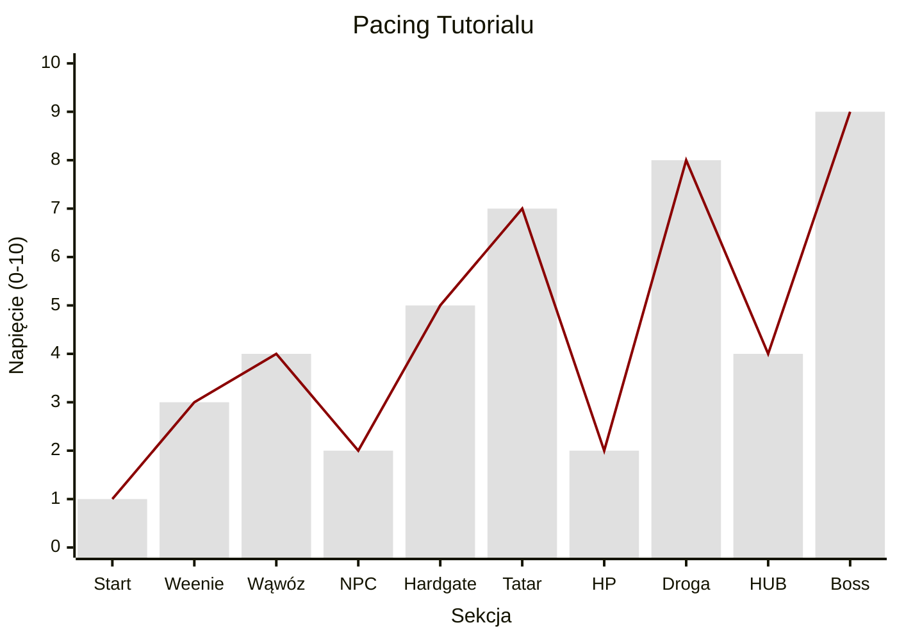
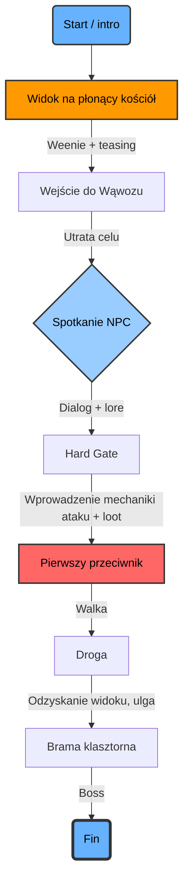

# Sandomiria Demonicum

## Tutorial/poziom pierwszy

Poziom wprowadzający do świata oraz klimatu.

### Beat chart

Ta tabela poniżej zwana *beat chartem*, zaczerpnięta została z książki **Scotta Rogersa**[^1].

|  #  | Beat   | Gameplay, narracja, game feel                                                                                                                                                                | Kontekst / intencja twórcza                                                                                                                                                                                                                                     |
| :-: | :----- | :------------------------------------------------------------------------------------------------------------------------------------------------------------------------------------------- | :-------------------------------------------------------------------------------------------------------------------------------------------------------------------------------------------------------------------------------------------------------------- |
|  1  | Intro  | Poziom rozpoczyna się od czarnego ekranu. Słychać piorun, stukot kopyt oraz jakby wóz. Pojawia się tekst "*Dalej Cię nie podwiozę...*". (Dźwięk strzału z bata, odgłos odjeżdżających koni). | Budowanie nastroju grozy i osamotnienia (*in media res*)[^2].                                                                                                                                                                                                   |
|  2  | Weenie | Gracz przejmuje kontrolę. Po krótkim marszu na horyzoncie ukazuje się płonący kościół (*weenie*[^3]) w oddali (*teasing*[^4]).                                                               | Złożenie obietnicy graczowi oraz foreshadowing gdzie ma dotrzeć, na końcu poziomu[^5]. Płonące kościoły też po prostu idą twardo.                                                                                                                               |
|  3  | Homage | Postać gracza mówi do siebie coś w stylu "*świętość tego miejsca została splugawiona*"[^6].                                                                                                  | Mrugnięcie okiem do gracza oraz ukłon w stronę klasyki.                                                                                                                                                                                                         |
|  4  | ?      | Gracz wchodzi w porośnięty drzewami wąwóz. Ściany terenu zasłaniają widok na kościół.                                                                                                        | Zastosowanie game devowej sztuczki. Tak na prawdę ten kościół w oddali to tylko makieta, do której gracz nie dotrze. Po wejściu do wąwozu, model ten zniknie, na rzecz faktycznego, grywalnego, który nie jest aż-tak-daleko, jak pierwotnie gracz widział[^7]. |
|  5  | NPC    | Spotkanie z romskim kupcem, który ledwo uszedł z życiem. W dialogu pada zdanie w stylu "*(...) it's quite demonic...*".                                                                      | Nawiązanie do stylu filmów Dark Fantasy z lat 80., które często używały tytułu w dialogach[^8].                                                                                                                                                                 |
|  6  | Nauka  | Wąwóz zwęża się. Przejście blokuje beczka/barykada. Gracz musi ją zniszczyć (nauka ataku). Z beczki wypada mikstura lecząca.                                                                 | **Hard gate**[^9]: gracz musi użyć broni. Miksturę zbierze mimowolnie, wchodząc w nią.                                                                                                                                                                          |
|  7  | Walka  | Spotkanie Nieumarłego Tatara. Wróg jest odwrócony tyłem, pożywia się martwym psem. Powoli odwraca głowę w stronę gracza (face-revealing turn[^10]).                                          | Wywołanie emocji (chęć zemsty za psa). Nauka ciosów kierunkowych w bezpiecznej przestrzeni (jeden przeciwnik).                                                                                                                                                  |
|  8  | Droga  | Prosta droga jest zablokowana. Gracz musi iść na około, krętymi ścieżkami pod górę, walcząc z kolejnymi wrogami.                                                                             | Wertykalność poziomu może dać widok na przebytą drogę, co daje poczucie progresu[^11].                                                                                                                                                                          |
|  9  | Ulga   | Gracz dociera do wrót klasztoru, mimo że ognia już nie ma, nadal coś jest nie tak...                                                                                                         | Zabawa z graczem i jego poczuciem bezpieczeństwa. Zazwyczaj środek kościoła to taka strefa *sacrum*.                                                                                                                                                            |
| 10  | Boss   | Drzwi otwierają się, a na dziedzińcu czeka na gracza potężniejszy Tatar (Mini-Boss).                                                                                                         | Punkt kulminacyjny tutorialu.                                                                                                                                                                                                                                   |

### Pacing

### Level flow

[^1]: Scott Rogers, *Level Up! The Guide to Great Video Game Design*, John Wiley & Sons, Ltd, 2010, s. 77.

[^2]: https://pl.wikipedia.org/wiki/In_medias_res (dostęp: 2026-01-18).
	Klasyczna ikonografia Dark Fantasy (np. scena otwierająca *Berserk*, 1997.)

[^3]: Termin ukuty przez **Walta Disneya**. Zob. S. Rogers, *Everything I Learned About Level Design I Learned from Disneyland*, [wideo online], YouTube, https://youtu.be/P4uPwhSqW8Q?si=4J0exIvH6ZdRXBZH (dostęp: 17.01.2026).

[^4]: Kullman Alexander, *Level Design. In Pursuit of Better Levels*, s. 46. https://docs.google.com/document/d/1fAlf2MwEFTwePwzbP3try1H0aYa9kpVBHPBkyIq-caY/edit?tab=t.0 (dostęp: 18.01.2026).

[^5]: Zabieg typowy dla gier Valve (np. widok Cytadeli na początku Half-Life 2 jest "obietnicą" finałowej konfrontacji). Zob. *Half-Life 2*, prod. Valve Corporation, 2004, Komentarz Deweloperski (Developer Commentary), rozdz. 1: Point Insertion (komentarz Eric Kirchmer - The Citadel).

[^6]: Jest to *Homage* do oryginalnego *Diablo* (1996). Tekst ("*The sanctity of this place has been fouled*") wypowiada każda postać po wejściu do Katedry. Craddock D.L., *Stay Awhile and Listen: Book I*, Canton 2013. W *Diablo II* mamy do czynienia z podobnym zabiegiem, na początku gry, w "Siedlisku Zła" (*Den of Evil*), natomiast w [Diablo III gracz może napotkać się na easter egg z tym związany](https://allthetropes.org/wiki/Diablo_III#:~:text=Upon%20entering%20one%20of%20the%20random%20micro%2Ddungeons%20in%20Act%20IV%2C%20Kormac%20exclaims%20%22The%20Sanctity%20of%20this%20place%20has%20been%20fouled!%22).

[^7]: Totten Christopher W., *An Architectural Approach to Level Design*, Taylor & Francis Group, 2019, s. 289.

[^8]: Powtórzenie w dialogu tytuły – [zabieg często spotykany w kinie klasy B i Dark Fantasy lat 80. (np. *Deathstalker II: Duel of the Titans*)](https://tvtropes.org/pmwiki/pmwiki.php/TitleDrop/LiveActionFilms#:~:text=Deathstalker%20II%3A%20Duel,and%20Deathstalker%20too.) (dostęp: 18.01.2026).

[^9]: *The Level Design Book*, https://book.leveldesignbook.com/process/layout/typology/gates (dostęp: 18.01.2026).

[^10]: Kolejny homage do klasyki. *Resident Evil*, prod. Capcom, reż. Mikami Shinji, 1996.
	*Face-revealing turn*, https://tvtropes.org/pmwiki/pmwiki.php/Main/FaceRevealingTurn (dostęp: 18.01.2026).

[^11]: Totten Christopher W., *op. cit*., s. 125.
